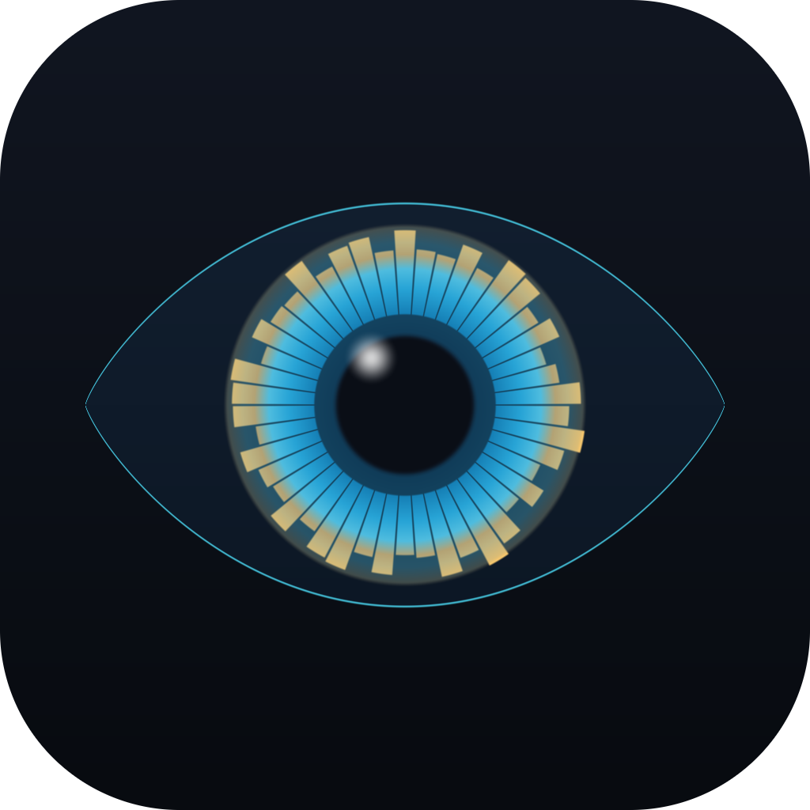
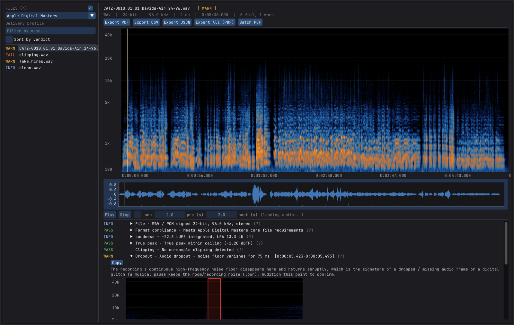
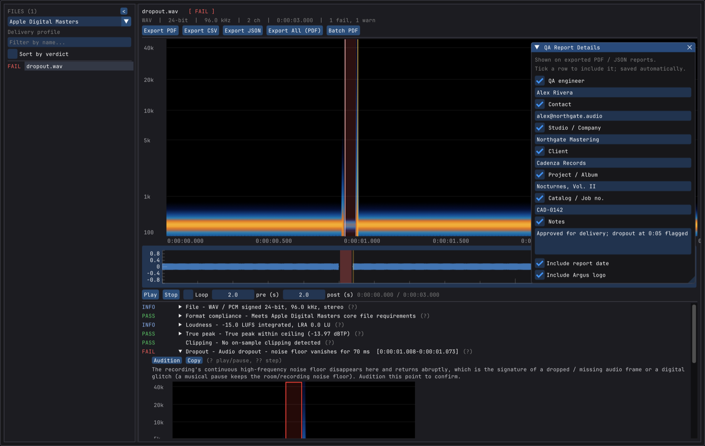
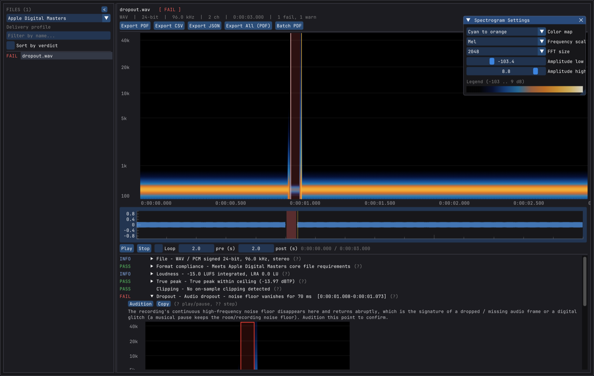
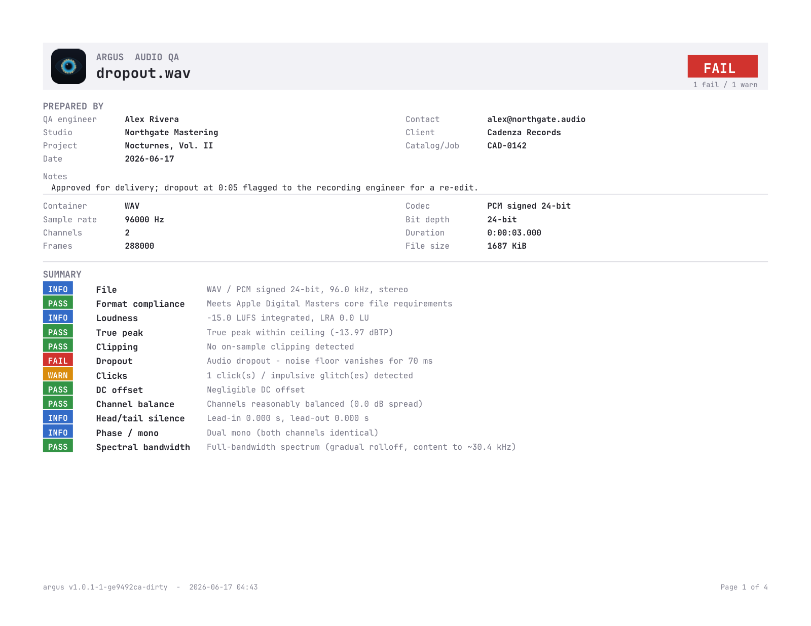

<div align="center">



# Argus

**Audio master QA — catch the defects before your masters ship.**

[](https://github.com/DonQuinleone/Argus/actions/workflows/ci.yml)
[](LICENSE)


Argus is a fast, cross‑platform desktop + CLI tool that inspects delivered audio
masters for dropped frames, glitches, clipping, true‑peak / loudness violations
and other defects — then turns the findings into an engineer‑facing **PDF / CSV /
JSON** report you can hand straight to a recording engineer or wire into CI.

</div>



---

## Highlights

- 🔎 **Comprehensive defect suite** — integrity/format, loudness (LUFS/LRA),
  true‑peak (dBTP), clipping, dropouts, clicks, silence/DC, phase and spectral
  brick‑wall detection, each with a severity and plain‑English summary.
- 🎚️ **RX‑style spectrogram** with selectable colormap, frequency scale, FFT size
  and amplitude range, plus boxed close‑ups of every finding.
- 🎧 **Audition** — play the region around any finding with pre/post‑roll and
  looping; a playhead tracks the spectrogram and waveform.
- 🧾 **Delivery profiles** — check against Apple Digital Masters, a streaming
  target, a CD master spec, or a permissive profile — switchable per run.
- 🖊️ **QA sign‑off details** — stamp the QA engineer, studio, client, project,
  catalog number and notes (plus your logo) onto every PDF.
- 📤 **Exports** — per‑file PDF/CSV/JSON, a one‑row‑per‑file summary CSV, a single
  combined batch PDF, or a batch JSON document.
- 🤖 **CI‑ready** — a headless CLI with machine‑readable JSON and an exit code that
  reflects the worst finding (`0` clean, `1` warn, `2` fail).
- 🎵 **Broad format support** — WAV, AIFF, FLAC, CAF, Ogg, MP3 (via libsndfile)
  **plus AAC / Apple Lossless** (`.m4a`) via the OS codec stack / FFmpeg.

## What it checks

| Area | Checks |
|---|---|
| **Integrity / format** | container, codec, bit depth, sample rate, channels, duration; profile compliance (bit depth, channels, approved rates, lossless); truncation |
| **Loudness** | integrated LUFS, loudness range (LRA), sample peak, per‑DSP target deltas, optional profile loudness target |
| **True peak** | dBTP vs the delivery ceiling (ITU‑R BS.1770), the modern predictor of encoder clipping |
| **Clipping** | runs of consecutive full‑scale samples (on‑sample clipping) |
| **Dropouts** | sudden collapse of the HF noise floor — the signature of a dropped/missing frame, distinct from a musical pause |
| **Clicks** | isolated sample‑level discontinuities (interpolation‑residual outliers) |
| **Silence / DC** | leading/trailing silence, embedded digital‑zero gaps, DC offset, channel imbalance, dead channels |
| **Phase** | inter‑channel correlation / mono compatibility, dual‑mono detection |
| **Spectral** | bandwidth and brick‑wall cutoff detection (upsampled “fake hi‑res” / lossy‑sourced material) |

Each finding carries a severity (`PASS` / `INFO` / `WARN` / `FAIL`), a friendly
summary, and an engineer‑facing table of the technical numbers.

## Screenshots

| QA report details | Spectrogram & settings |
|---|---|
|  |  |

### Exported PDF report



## Delivery profiles

Spec checks are driven by a selectable profile (in the app’s left panel, or
`--profile` on the CLI):

| Profile | Rules |
|---|---|
| **Apple Digital Masters** *(default)* | 24‑bit, stereo, approved rates, lossless; −1 dBTP ceiling |
| **Streaming (−14 LUFS / −1 dBTP)** | stereo, common rates; −1 dBTP ceiling; −14 LUFS target |
| **CD master (16‑bit / 44.1)** | 16‑bit, stereo, 44.1 kHz; −0.1 dBTP ceiling |
| **Permissive (no spec)** | no format rules; reports true‑peak headroom only |

List them with `argus --list-profiles`.

---

## Installation

### macOS

Download `Argus-<version>.dmg`, open it and drag **Argus** to Applications.

> Argus is currently **unsigned**, so on first launch macOS Gatekeeper will warn
> that it’s from an unidentified developer. Right‑click the app and choose
> **Open** (once), or run:
> ```bash
> xattr -dr com.apple.quarantine /Applications/Argus.app
> ```

### Linux

```bash
# Debian / Ubuntu / Mint / Pop!_OS
sudo apt install ./argus_<version>_amd64.deb

# Fedora / RHEL / Alma / Rocky
sudo dnf install ./argus-<version>.x86_64.rpm

# Arch / Manjaro (from the bundled PKGBUILD)
makepkg -si

# Any distro — no install, just run:
chmod +x Argus-<version>-x86_64.AppImage && ./Argus-<version>-x86_64.AppImage
```

Build scripts for each format live in [`packaging/linux/`](packaging/linux). For
AAC/ALAC support, install FFmpeg (`libavformat`, `libavcodec`, `libavutil`).

### Windows

Run `Argus-<version>-setup.exe` and follow the installer. The build is unsigned,
so SmartScreen may show an “unknown publisher” prompt — choose **More info →
Run anyway**.

---

## Build from source

Requirements: a **C++20** compiler and **CMake ≥ 3.16**. GLFW, Dear ImGui, ImPlot
and libebur128 are fetched and built automatically; **libsndfile** is the one
system dependency.

```bash
# macOS
brew install cmake libsndfile

# Debian / Ubuntu  (X11 + native Wayland)
sudo apt install cmake g++ pkg-config libsndfile1-dev libgl1-mesa-dev xorg-dev \
                 libwayland-dev libwayland-bin wayland-protocols libxkbcommon-dev libdecor-0-dev
#   optional, for AAC/ALAC decode:
sudo apt install libavformat-dev libavcodec-dev libavutil-dev

# Fedora / Alma / RHEL
sudo dnf install cmake gcc-c++ libsndfile-devel mesa-libGL-devel \
                 libXrandr-devel libXinerama-devel libXcursor-devel libXi-devel \
                 wayland-devel libxkbcommon-devel wayland-protocols-devel libdecor-devel
#   optional, for AAC/ALAC decode:  sudo dnf install ffmpeg-devel

# Windows: install CMake + libsndfile (e.g. via vcpkg) and build with MSVC.
```

```bash
cmake -S . -B build -DARGUS_BUILD_GUI=ON
cmake --build build -j
```

This produces:

- `build/argus` — the command‑line analyser (no GUI deps; ideal for CI).
- `build/src/ui/Argus.app` — the desktop app on macOS (a native bundle with a menu
  bar and icon); `argus-gui` on Windows/Linux.

Omit `-DARGUS_BUILD_GUI=ON` to build only the CLI and analysis engine. The app
bundles **JetBrains Mono** (UI + PDF) and a generated icon; both are regenerated
by `tools/embed_font.py` / `tools/make_icon.py` and committed, so the normal build
needs no extra tooling.

## Usage

### Desktop app

Open files/folders from the **File** menu (native menu bar on macOS) or drag them
onto the window. Folders are scanned **recursively**. Pick a delivery profile on
the left, select a file to see its spectrogram, waveform and findings, and click a
marker or a finding to jump to it.

- **Audition** — **Space** play/pause, **←/→** step findings, **Esc** stop.
- **QA Report Details** (View menu) — enter the engineer/studio/client/etc. shown
  on exported reports; every field is individually toggleable.
- **Export** the current file to PDF/CSV/JSON, the whole batch to a summary CSV/JSON,
  a folder of PDFs, or one combined batch PDF.
- Window geometry, spectrogram settings, theme, profile, layout, audition prefs and
  QA details all persist between launches.

### Command line

```bash
argus <file-or-directory> [more paths...]        # print reports

argus --pdf  <dir>   <input>                      # write <name>_QA.pdf per file
argus --csv  <dir>   <input>                      # write <name>_QA.csv per file
argus --json <dir>   <input>                      # write <name>_QA.json per file
argus --batch-csv  <file> <dir>                   # one‑row‑per‑file summary CSV
argus --batch-json <file> <dir>                   # one JSON document for the batch
argus --batch-pdf  <file> <dir>                   # one combined PDF for the batch
argus --profile <name|index> ...                  # delivery profile for spec checks
argus --list-profiles                             # show the built‑in profiles
```

**Exit code:** `0` clean/info, `1` warnings, `2` failures — handy for CI gating.

Stamp QA / sign‑off details onto CLI exports via environment variables (great for
pipelines):

```bash
ARGUS_QA_ENGINEER="Alex Rivera" ARGUS_QA_STUDIO="Northgate Mastering" \
ARGUS_QA_CLIENT="Cadenza Records" ARGUS_QA_PROJECT="Nocturnes, Vol. II" \
  argus --pdf out/ masters/
```

(Also: `ARGUS_QA_CONTACT`, `ARGUS_QA_CATALOG`, `ARGUS_QA_NOTES`.)

## How dropout detection works

A dropped/missing frame is replaced by silence or near‑zero, so the recording’s
*continuous high‑frequency noise floor* momentarily disappears and snaps back.
Music never does this — even a quiet pause keeps the room/recording floor. Argus
high‑pass filters at 12 kHz, estimates the noise floor from the 5th percentile of
content frames, and flags any spot that drops ~13 dB below it — isolating real
dropouts with effectively zero false positives across a full‑length programme.

## Tests

```bash
python3 tests/make_fixtures.py /tmp/argus_fixtures   # synthesise defect fixtures
ARGUS=build/argus tests/run_tests.sh                 # assert each detector fires
```

## Project layout

```
src/core/            headless analysis engine (no UI dependency)
  Decoder            libsndfile + platform AAC/ALAC -> float buffers + metadata
  Profile            delivery profiles (Apple Digital Masters, streaming, ...)
  analysis/          one file per check (Dropouts, Clipping, Loudness, ...)
  dsp/               FFT, envelope, filters
  render/            STFT spectrogram + colormaps
  export/            PDF + CSV + JSON writers (self‑contained)
  decode/            per‑platform AAC/ALAC decoders (CoreAudio/MF/FFmpeg)
src/cli/             console report formatting
src/ui/              Dear ImGui desktop front‑end
packaging/           macOS .dmg, Windows NSIS, Linux .deb/.rpm/PKGBUILD/AppImage
tests/               fixture generator + regression runner
```

The engine in `src/core/` has no UI dependency, so it runs headless in CI via the
`argus` CLI.

## Roadmap

Ideas under consideration for future releases:

- A‑B / reference comparison between two versions of a master.
- Watch‑folder mode that auto‑QAs files dropped into a directory.
- User‑editable custom delivery profiles (saved to disk).
- Spectrogram PNG export and embedded‑metadata (BWF/iXML) inspection.

## License

Argus is released under the **GNU General Public License v3.0** — see [LICENSE](LICENSE).
